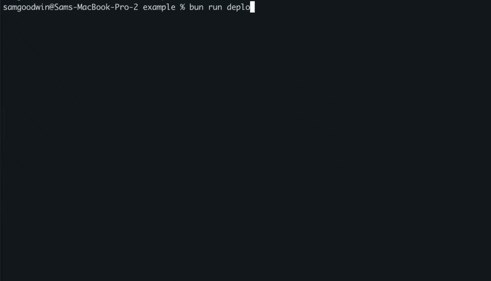

> ⚠️ alchemy-effect is still experimental and not ready for production use (expect breaking changes). Come hang in our [Discord](https://discord.gg/jwKw8dBJdN) to participate in the early stages of development.

# alchemy-effect

`alchemy-effect` is an **Infrastructure-as-Effects (iae)** framework that unifies business logic and infrastructure config into a single, type-safe program.

A program built with `alchemy-effect` is guaranteed to be configured correctly by the type system - e.g. type-checked Bindings ensure your IAM Policies are least-privilege 🔐.

This example demonstrates the type errors you receive when attempting to grant excessive or missing permissions to a Lambda Function:


An `alchemy-effect` program produces a Plan that can be reviewed prior to deployment:



# Resources

Resources are declared along-side your business logic as classes, e.g. a FIFO SQS Queue:

```ts
class Messages extends SQS.Queue("Messages", {
  fifo: true,
  schema: S.String,
}) {} 
```

# Functions

Functions are a special kind of Resource that includes a runtime implementation function.

The function always returns an `Effect<A, Err, Req>` which is then used to infer Capabilities and type-check your Bindings.

```ts
class Api extends Lambda.serve("Api", {
  fetch: Effect.fn(function* (event) {
    yield* SQS.sendMessage(Messages, event.body!).pipe(
      Effect.catchAll(() => Effect.void),
    );
  }),
})({
  main: import.meta.filename,
  bindings: $(SQS.SendMessage(Messages)),
}) {}
```

# Bindings

A Binding is a connection between a **Resource** and a **Function** that satisfies a **Capability** dependency (e.g. `SQS.SendMessage`).

> [!TIP]
> Bindings are inferred from your business logic and then type-checked to ensure least-privilege IAM policies.

```ts
class Api extends Lambda.serve("Api", {
  // ...
})({
  main: import.meta.filename,
  // Policy<Lambda.Function, SQS.SendMessage<Messages>, unknown>
  bindings: $(SQS.SendMessage(Messages)),
}) {}
```

> [!CAUTION]
> Curring (`Lambda.serve(..)({ .. })`) is required because there's a limitation in TypeScript. We hope to simplify this in the future.

# Library-first

`alchemy-effect` is library-first, meaning that even our CLI is exposed as a moduel you can import and use in your own projects.

# Plan & Deploy

Create a Plan and then Deploy it to your infrastructure


## Type-Safe Plan

All knowable information about the Plan is available at compile-time, for example the type of the Plan is:


> [!TIP]
> These types can be used to implement type-level validation of infrastructure policies, e.g. disallowing publicly accessible S3 buckets.

# Components

Infrastructure and business logic can be encapsulated as a Component using a simple function. 

> [!TIP]
> Components are very similar to React components, but for infrastructure. Instead of declaring state in your closure and returning a React element, you declare Resources and return a `Function`.

```ts
const Monitor = <const ID extends string, ReqAlarm, ReqResolved>(
  id: ID,
  {
    onAlarm,
    onResolved,
  }: {
    onAlarm: (
      batch: SQS.QueueEvent<Message>,
    ) => Effect.Effect<void, never, ReqAlarm>;
    onResolved?: (
      batch: SQS.QueueEvent<Message>,
    ) => Effect.Effect<void, never, ReqResolved>;
  },
) => {
  class Messages extends SQS.Queue(`${id}-Messages`, {
    fifo: true,
    schema: Message,
  }) {}

  return <const Props extends Lambda.FunctionProps<ReqAlarm | ReqResolved>>({
    bindings,
    ...props
  }: Props) =>
    Lambda.consume(id, {
      queue: Messages,
      handle: Effect.fn(function* (batch) {
        yield* SQS.sendMessage(Messages, {
          id: 1,
          value: "1",
        }).pipe(Effect.catchAll(() => Effect.void));
        if (onAlarm) {
          yield* onAlarm(batch);
        }
        if (onResolved) {
          yield* onResolved(batch);
        }
      }),
    })({
      ...props,
      // Components are not leaky - the inner SQS.SendMessage(Messages) binding is not required to be passed in by the caler
      bindings: bindings.and(SQS.SendMessage(Messages)),
    });
};
```